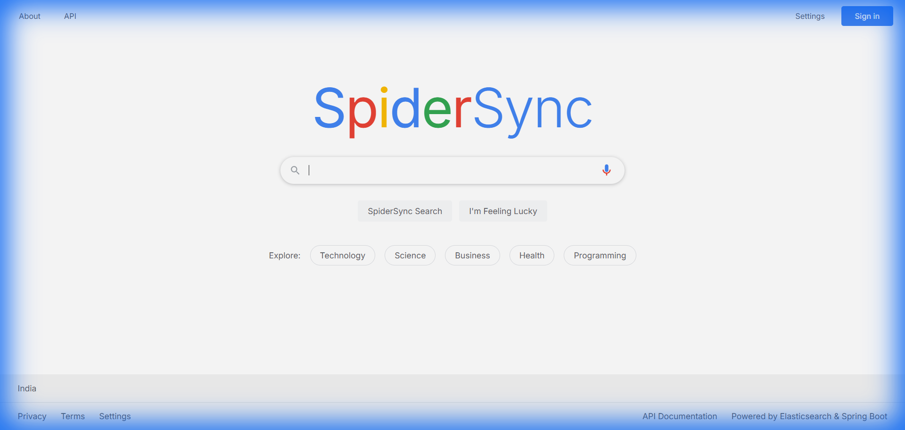
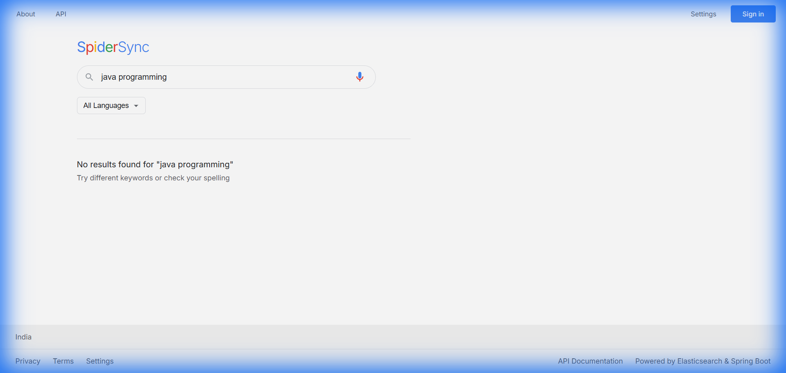
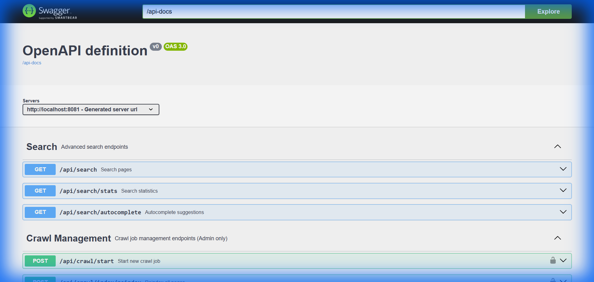
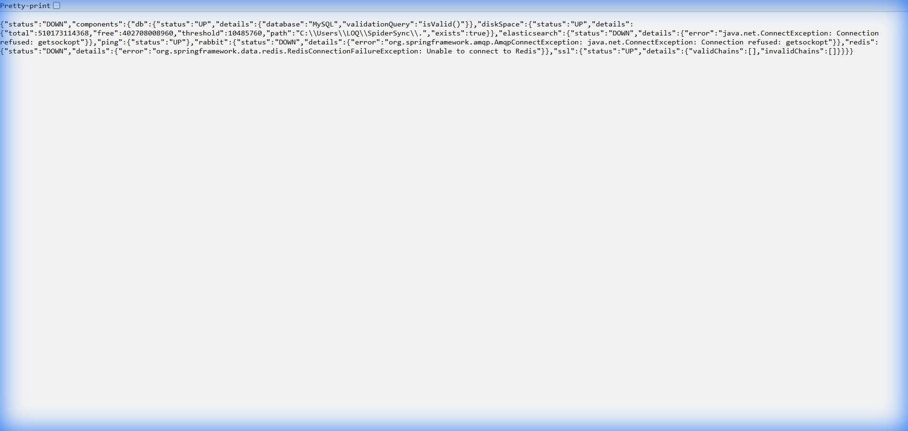
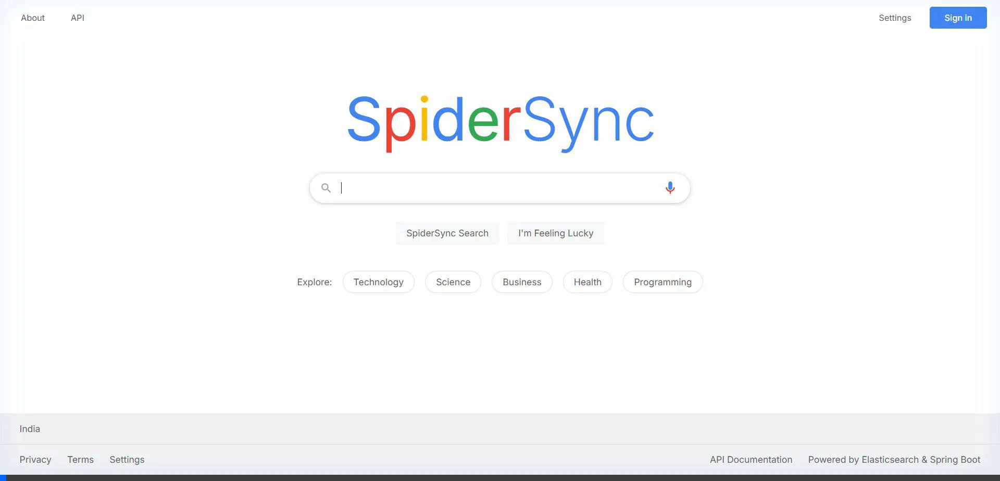

# 🕷️ SpiderSync - Web Search Engine

[](https://github.com/Annkit-rgb/SpiderSync/actions/workflows/ci.yml)
[](https://www.oracle.com/java/)
[](https://spring.io/projects/spring-boot)
[](LICENSE)
[](CONTRIBUTING.md)

A web search engine built with Spring Boot, Elasticsearch, Redis, and RabbitMQ. Features include web crawling, full-text search with BM25 ranking, NLP keyword extraction, and a clean UI.

## Screenshots

### Homepage


### Search Results


### API Documentation


### Health Monitoring


### Demo


## Features

### Search
- Full-text search with Elasticsearch (BM25 ranking)
- Web crawler with robots.txt compliance
- NLP keyword extraction and content analysis
- Real-time autocomplete
- Language and ranking filters
- Content deduplication (SHA-256)
- Page rank calculation

### Infrastructure
- Distributed crawling with RabbitMQ
- Redis + Caffeine caching
- HikariCP connection pooling
- Async processing
- Flyway database migrations

### Security & API
- JWT authentication
- Role-based access control
- Rate limiting
- RESTful API with Swagger docs
- CORS support

### Monitoring
- Health checks (MySQL, Elasticsearch, Redis, RabbitMQ)
- Prometheus metrics
- Structured logging
- Search analytics

### UI
- Responsive design
- Real-time search
- Autocomplete
- Mobile-friendly

## 🏗️ Architecture

```
┌─────────────┐     ┌──────────────┐     ┌─────────────┐
│   Browser   │────▶│  Spring Boot │────▶│   MySQL     │
│     UI      │     │  Application │     │  Database   │
└─────────────┘     └──────────────┘     └─────────────┘
                           │
                           ├────────────▶ Elasticsearch
                           │              (Search Index)
                           │
                           ├────────────▶ Redis
                           │              (Cache)
                           │
                           └────────────▶ RabbitMQ
                                          (Crawl Queue)
```

## 🚀 Quick Start

### Prerequisites
- Java 21
- Maven 3.8+
- Docker & Docker Compose (for external services)

### 1. Start External Services

```bash
docker-compose up -d
```

This starts:
- MySQL (port 3306)
- Elasticsearch (port 9200)
- Redis (port 6379)
- RabbitMQ (port 5672, Management UI: 15672)

### 2. Build and Run Application

```bash
mvn clean install
mvn spring-boot:run
```

The application will start on `http://localhost:8081`

### 3. Access the Application

- **Search UI**: http://localhost:8081
- **API Documentation**: http://localhost:8081/swagger-ui.html
- **Health Check**: http://localhost:8081/actuator/health
- **Metrics**: http://localhost:8081/actuator/metrics

## 📖 API Documentation

### Search Endpoints

#### Search Pages
```http
GET /api/search?q={query}&language={lang}&page={page}&size={size}
```

#### Autocomplete
```http
GET /api/search/autocomplete?q={prefix}&size={size}
```

#### Search Statistics
```http
GET /api/search/stats
```

### Crawl Management (Admin Only)

#### Start Crawl
```http
POST /api/crawl/start?seedUrl={url}
Authorization: Bearer {jwt_token}
```

#### List Crawl Jobs
```http
GET /api/crawl/jobs
Authorization: Bearer {jwt_token}
```

#### Create Elasticsearch Index
```http
POST /api/crawl/index/create
Authorization: Bearer {jwt_token}
```

## 🔧 Configuration

Key configuration properties in `application.properties`:

```properties
# Crawler Settings
crawler.threads=5
crawler.delay.ms=1000
crawler.max-depth=3
crawler.respect-robots-txt=true

# Elasticsearch
elasticsearch.host=localhost
elasticsearch.port=9200

# Redis
spring.data.redis.host=localhost
spring.data.redis.port=6379

# RabbitMQ
spring.rabbitmq.host=localhost
spring.rabbitmq.port=5672
```

## 🔐 Authentication

Default admin credentials:
- **Username**: admin
- **Password**: admin123
- **API Key**: admin-api-key-change-this-in-production

⚠️ **Important**: Change these credentials in production!

## 📊 Database Schema

The application uses MySQL with the following main tables:
- `pages` - Indexed web pages with full-text search
- `crawl_jobs` - Crawl job tracking
- `search_queries` - Search analytics
- `users` - User authentication

Migrations are managed by Flyway in `src/main/resources/db/migration/`

## 🧪 Testing

```bash
# Run all tests
mvn test

# Run with coverage
mvn verify
```

## 📦 Production Deployment

### Using Docker

```bash
# Build application
mvn clean package -DskipTests

# Run with production profile
java -jar target/SpiderSync-0.0.1-SNAPSHOT.jar --spring.profiles.active=prod
```

### Environment Variables

Set these environment variables for production:

```bash
DB_URL=jdbc:mysql://your-db-host:3306/search_engine
DB_USERNAME=your-username
DB_PASSWORD=your-password
ELASTICSEARCH_HOST=your-es-host
REDIS_HOST=your-redis-host
RABBITMQ_HOST=your-rabbitmq-host
JWT_SECRET=your-secret-key
```

## 🛠️ Technology Stack

- **Backend**: Spring Boot 4.0.1, Java 21
- **Search**: Elasticsearch 8.11.1
- **Cache**: Redis 7.x, Caffeine
- **Message Queue**: RabbitMQ 3.x
- **Database**: MySQL 8.0
- **Security**: Spring Security, JWT
- **Web Crawling**: Jsoup, Apache HttpClient
- **NLP**: Apache OpenNLP, Custom TF-IDF
- **API Docs**: Springdoc OpenAPI
- **Monitoring**: Micrometer, Prometheus

## 📈 Performance

- **Search Response Time**: < 100ms (with caching)
- **Crawl Rate**: Configurable (default: 1 request/second)
- **Concurrent Crawlers**: 5 threads (configurable)
- **Cache Hit Rate**: ~80% for popular queries

## 🤝 Contributing

1. Fork the repository
2. Create a feature branch
3. Commit your changes
4. Push to the branch
5. Create a Pull Request

## License

MIT License - feel free to use this project however you want.

## Author

Annkit - [GitHub](https://github.com/Annkit-rgb)

## Support

- Open an issue if you find bugs
- Check `/swagger-ui.html` for API docs
